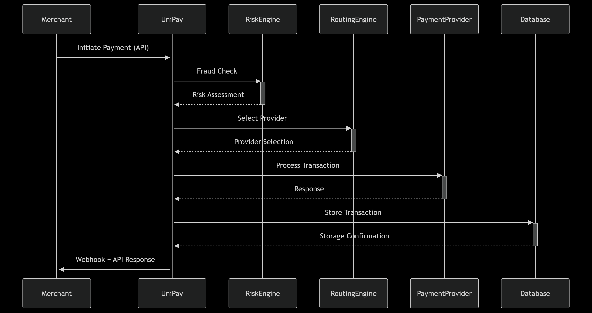

# Payment Gateway - Monolithic Java Spring Boot

A monolithic payment gateway API

## Features

- User authentication and authorization
- Merchant onboarding and KYC
- Payment request and processing
- Transaction lifecycle management
- Merchant dashboards
- Scheduled payouts
- Notifications and webhooks

## Tech Stack

- Java 17
- Spring Boot 3
- Spring Security (JWT)
- Spring Data JPA (PostgreSQL)
- MapStruct, Lombok
- Flyway (Database migrations)

## Project Modules

### 1. User Management
- `/api/auth/register`
- `/api/auth/login`
- `/api/users/me`

### 2. Merchant Onboarding
- `/api/merchant/apply`
- `/api/merchant/kyc-status`

### 3. Payment Processing
- `/api/payment/create`
- `/api/payment/status/{id}`
- `/api/payment/callback`

### 4. Dashboard
- `/api/merchant/dashboard`
- `/api/admin/dashboard`

### 5. Payouts
- `/api/payout/manual`
- `/api/payout/schedule`

## Database Schema (Simplified)

- `users(id, email, password, role, verified)`
- `merchants(id, user_id, business_name, kyc_status)`
- `transactions(id, merchant_id, amount, status, created_at)`
- `payouts(id, merchant_id, amount, status, scheduled_for)`

## Setup

```bash
# Clone the repository
git clone https://github.com/your-org/payment-gateway.git
cd payment-gateway

# Build the project
./mvnw clean install

# Run the app
./mvnw spring-boot:run
```

## 🚀 Steps to Contribute

1. **Fork the repository**

2. **Create a branch** using the following naming convention:  
   `UP-01-description-of-feature`  
   (Use `UP-02`, `UP-03`, etc. for subsequent features)

3. **Branch from `develop`**:
```bash
git checkout develop
git pull origin develop
git checkout -b UP-01
```

## 🛠️ System Architecture

### C4 Model Overview
**Context Level**:
```plaintext
+----------------+       +----------------+       +-----------------+
|   Merchant     |       |   Payment      |       |  Banking        |
|   Applications |<----->|   Providers    |<----->|  Systems        |
+----------------+       +----------------+       +-----------------+
          ▲                        ▲                        ▲
          |                        |                        |
          ▼                        ▼                        ▼
+---------------------------------------------------------------+
|                        UniPay Core System                     |
+---------------------------------------------------------------+
```

### Key Flow: Payment Processing


## Contributing

Open an issue or submit a pull request.

## License

MIT


